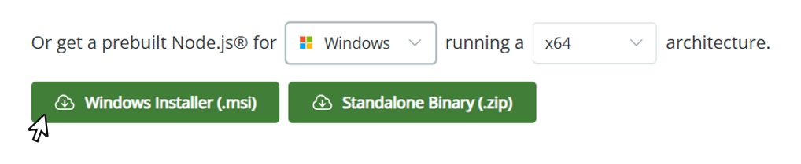

<p align="center">
  
</p>

<h1 align="center">NAViFluX</h1>

<p align="center">
  <b>A Web-based Platform for Analysis of Metabolic Pathways for Genome Scale Metabolic Models (GEMs)</b>
</p>

<p align="center">
  
  
  
  
  
  <a href="https://doi.org/10.5281/zenodo.19107831">
    
  </a>
</p>


## About NAViFluX

**NAViFluX** is an interactive visualization platform designed to explore, analyze, and interpret **metabolic networks and flux distributions** of Genome Scale Metabolic Models (GEMs) in an intuitive way.  

The software enables users to:
- Analyse and Visualize metabolic pathways of Genome Scale Metabolic Models (GEMs)
- Overlay omics results in the form of weight files
- Curation of GEMs using BiGG and KEGG databases
- Perform Flux Analysis, Centrality Analysis and Pathway Enrchiment over GEMs.

To know more about NAViFluX and it's use cases we highly recommend you to check out our [documentation](https://bnsb-lab-iith.github.io/NAViFluX-Documentation/). 

---

## Installation Guide

To run the application locally, please ensure the required dependencies are installed on your system. Follow the steps below based on your operating system.


## NodeJS Installation

### Step 1: Download Node.js

Go to the official Node.js website and download the installer for your operating system:  
https://nodejs.org/

- **Windows**  
  

- **MacOS**  
  

- **Linux**  
  


### Step 2: Install Node.js

Run the downloaded installer and follow the on-screen instructions:

- Accept the license agreement  
- Choose the installation directory (default recommended)  
- Ensure **“Add to PATH”** is checked  
- Complete the installation  


### Step 3: Verify Installation

Open a terminal or command prompt and run:

```bash
node --version
````

```bash
npm --version
```

If both commands return version numbers, Node.js and npm are installed successfully.

---

## Python Installation (Python 3.12)

### Step 1: Download Python

Download **Python 3.12** from the official website:
[https://www.python.org/downloads/](https://www.python.org/downloads/)

* **Windows**: Windows installer (64-bit)
* **MacOS**: macOS universal installer
* **Linux**: Use system package manager or build from source

### Step 2: Install Python

#### Windows

* Run the `.exe` installer
* **Check “Add Python to PATH”**
* Click **Install Now**

#### MacOS

* Open the `.pkg` installer
* Follow the installation wizard
* Python will be installed under `/usr/local/bin/python3`

#### Linux (Ubuntu / Debian)

```bash
sudo apt update
sudo apt install python3.12 python3.12-venv python3.12-dev
```

If Python 3.12 is not available via `apt`, install from source:

```bash
sudo apt install build-essential libssl-dev zlib1g-dev \
libncurses5-dev libncursesw5-dev libreadline-dev libsqlite3-dev \
libgdbm-dev libbz2-dev liblzma-dev tk-dev wget

wget https://www.python.org/ftp/python/3.12.0/Python-3.12.0.tgz
tar -xf Python-3.12.0.tgz
cd Python-3.12.0
./configure --enable-optimizations
make -j$(nproc)
sudo make altinstall
```


### Step 3: Verify Python Installation

```bash
python --version
```

or

```bash
python3 --version
```

Expected output:

```text
Python 3.12.x
```


### Step 4: Verify pip

```bash
pip --version
```

or

```bash
pip3 --version
```

---

## Download and Run NAViFluX

### Step 1: Get the Source Code

**Option 1: Clone the repository**

```bash
git clone https://github.com/bnsb-lab-iith/NAViFluX
```

**Option 2: Download ZIP**
Download the repository as a ZIP file and extract it.


### Step 2: Install Dependencies and Run

#### Windows

```powershell
.\install.ps1
.\run.ps1
```

#### Linux

```bash
./install.sh
./run.sh
```

#### MacOS

```bash
./install.sh
./run_mac.sh
```


## If the Scripts Don’t Work (Manual Setup)

You can manually start the frontend and backend as follows.


### Start the Frontend

Open your terminal and navigate to the source code root folder 

```bash
cd client
npm install
npm run dev
```


### Start the Backend

Open another terminal and again navigate to the source code root folder

```bash
cd server
python -m venv .venv
```

Activate the virtual environment:

* **Windows**

  ```powershell
  .venv\Scripts\activate
  ```

* **MacOS / Linux**

  ```bash
  source .venv/bin/activate
  ```

Install dependencies and run the server:

```bash
pip install -r requirements.txt
flask run
```

Once you execute the commands on both the terminals successfully, open the terminal where you started the `client` and open the displayed local URL (usually `localhost:5173`) in your browser.

## Test Datasets

The test data can be found in the `/data/TEST` directory.

### macOS Note

On macOS, loading `.mat` (MATLAB) model files may fail due to **incompatibilities in the scientific Python stack (SciPy / NumPy) on Python 3.12**, especially for certain MAT file formats. This can result in errors such as:

> *"Unknown mat file type, version 57, 52"*

Although the same `.mat` files may work on Windows or Linux, macOS environments often handle MAT file parsing differently due to differences in compiled dependencies and library support.

### Recommendation

Mac users are advised to use:

* **SBML files (`.xml`)** 
* **JSON models (`.json`)** 

instead of `.mat` files.

These formats are **cross-platform stable** and ensure consistent behavior across all systems.

## Citation

If you use **NAViFluX** in your research, please cite:

> **Manjunatha Beduru Krishnamurthy, P S Harish, & Abhishek Subramanian** (2026).  
> *NAViFluX: a visualization-centric platform for interactive analysis, refinement and design of genome-scale metabolic networks*.  
> Zenodo. https://doi.org/10.5281/zenodo.19107831


## License

This project is licensed under the **MIT License**. See the `LICENSE` file for details.


